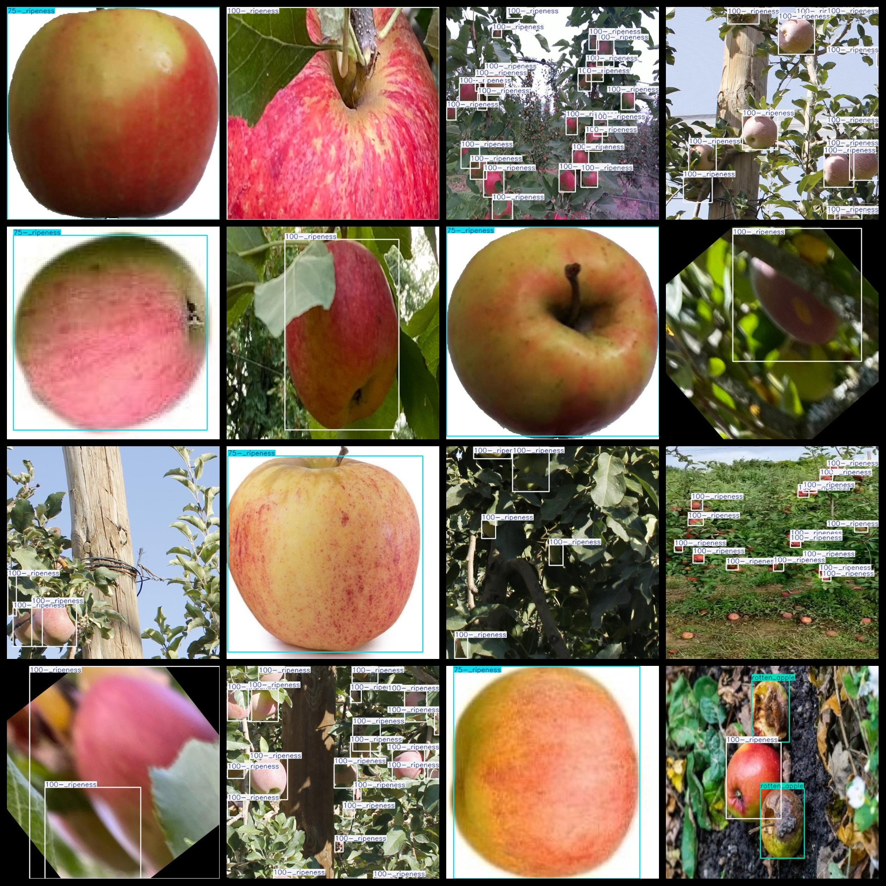
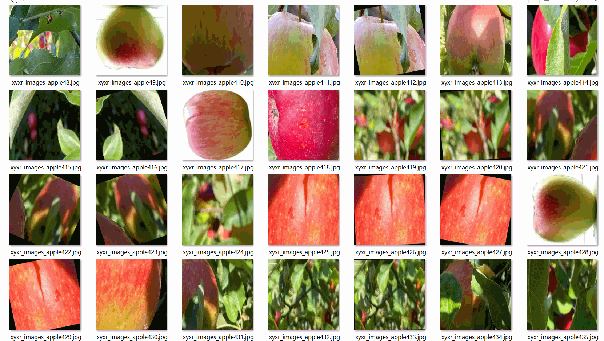

# Apple Ripeness Dataset 1158 images VOC+YOLO format

The Apple Ripenness dataset consists of 1158 images in both VOC and YOLO formats. The dataset is organized into three folders: JPEGImages, Annotations, and labels.

The JPEGImages folder contains a total of 1158 JPEG images.

The Annotations folder contains a total of 1158 XML files.

The labels folder contains a total of 1158 txt files.

There are a total of 4 types of labels: ["50-_ripeness", "75-_ripeness", "100-_ripeness", "rotten_apple"].

For each label, there are different number of boxes (the box numbers are not consistent with the order in the YOLO format, but they are consistent with the classes.txt file in the Annotations folder):

"50-_ripeness" has 4 boxes

"75-_ripeness" has 346 boxes

"100-_ripeness" has 3896 boxes

"rotten_apple" has 77 boxes

The total number of boxes is 4323.

The image resolution is clear (pixels).

The images have been enhanced.

The GitHub repository location is datasets_sl.

The shape of the labels is rectangular boxes, used for target detection recognition.

Special Note: No guarantee is made regarding the precision of the trained model or weight files. This dataset only provides accurate and reasonable annotations.

Labeling and Image Details:

## Images

---

Here is a pay link on Stripe (https://buy.stripe.com/3cs8yP7sY87d0vu9AB). Please contact me lonlonago@foxmail.com after funding $89, and I will send you a complete data files, thank you!

